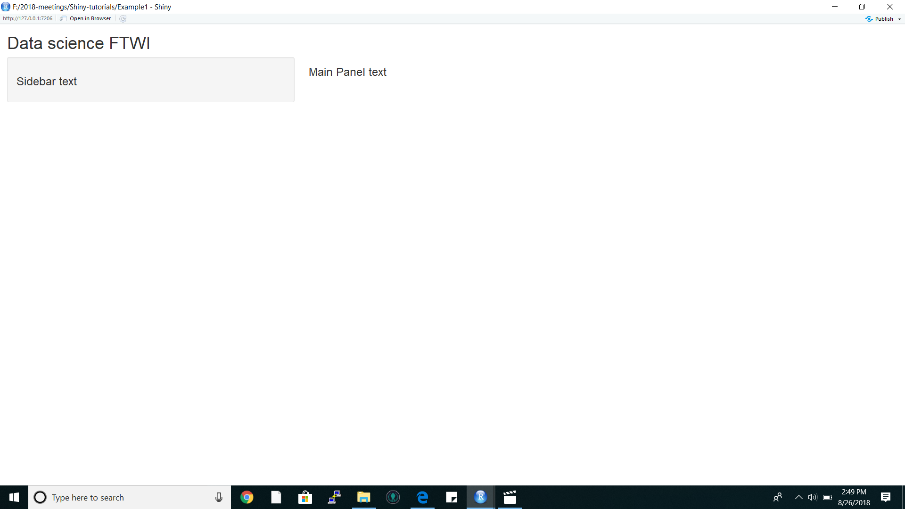

# How to develop a shiny app?

## Resources: Coursera Course - Developing Data Products 

## Users

  - Web app for your prediction algorithm: you want to create a web site so that users can input the relevant predictors and obtain their prediction.
  
## What is Shiny?

  - Shiny is a platform for creating interactive R programs embedded into a web page.  
  
## Three components in web pogamming

  - html: gives a webpage structure and sectioning as well as markup instructions
  
  - css: gives the style of the web page
  
  - java scripts (js): for interactivity
  
## Introduction to Shiny

- Step 1: Install shiny

```r
install.packages("shiny")
library(shiny)
```

- How to create a shiny project?

In order to create a shiny project you need two things:
        
        1. ui.R : For use interface, controls how it looks.
        
        2. server.R: Controls what it does/ perform the calculations.
        
  The two files need to be in the same directory (folder). 
  
## Example 1: Output format

  1. Following is a minimal example of ui.R

```r
library(shiny)
shinyUI(pageWithSidebar(

############### body ################

#----- title of my shiny app -----------
  headerPanel("Data science FTWI"),
#----- display of the sidebar panel-----
  sidebarPanel(
  h3('Sidebar text')
  ),
#----- display of the main panel--------
  mainPanel(
  h3('Main Panel text') # h3: 3rd level html heading
  )
#---------------------------------------
##########################################

))

```
  2.  server.R
  
  Following server.R function is not going to do anything.
  
```r
library(shiny)
shinyServer(
## Even though this function is not doing anything we need the following function to be included
  function(input, output){ 
  }
#............................
)

```
  3. runApp
  
  In R, change to the directories with these files and type runApp() as shown below

  
  
  4. Output

  

## Example 2: R function for HTML markups

Note: WHen creating a shiny app you should be careful of the the commas.

1. ui.R function

```r
library(shiny)
shinyUI(pageWithSidebar(

############### body ################

#----- title of my shiny app -----------
  headerPanel("Illustating markup"),
#----- display of the sidebar panel-----
  sidebarPanel(
  h1('Sidebar text'), # comma after every h label
  h1('H1 text'), 
  h2('H2 text'), 
  h3('H3 text'), 
  h4('H4 text') # no comma here
  ),
#----- display of the main panel--------
  mainPanel(
  h3('Main Panel text') ,
  code('some code'),
  p('some ordinary text')
  )
#---------------------------------------
##########################################

))
```

2. server. R

This is same as example 1

```r
library(shiny)
shinyServer(
 we need the following function to be included
  function(input, output){ 
  }
)
```
 3. Example 2: output

  

## Example 3: Illustrating inputs

1. ui.R

```r
library(shiny)
shinyUI(pageWithSidebar(
############### body ################
#----- title of my shiny app -----------
  headerPanel("Illustating inputs"),
#----- display of the sidebar panel-----
  sidebarPanel(
#........................................
numericInput('id1','Numeric input, labeled id1', 0, min=0, max=10, step=1),
## You will get a dropdown list where min is 0 and max is 10, increment by 1,
## id1: is the input label name
## "Numeric input, labeled id1" is the display label
 
#........................................
checkboxGroupInput("id2", "Checkbox",
                    c("Value 1" = "1",
                      "Value 2" = "2",
                      "Value 3" = "3")),
## Here you'll get a checkbox to include inputs
## id2: label name
## Checkbox: display label
#........................................
dateInput("date", "Date:")
  ),
## Here you'll get a blank box to include the date
## date: label name
## Date: display label
#----- display of the main panel--------
# This main panel display the outputs we entered above
  mainPanel(
  h3('Illustrating outputs'),
  h4('You entered'),
  # "id1" is the label you've given above, "oid1" is the associated output label in the the server.R function
  verbatimTextOutput("oid1"),
    h4('You entered'),
  verbatimTextOutput("oid2"),
  h4('You entered'),
  verbatimTextOutput("odate")

  )
#---------------------------------------
##########################################

))
```
2. server.R

```r
library(shiny)
shinyServer(
#--- Write the function to take corresponding inputs and outputs--------------------------------
  function(input, output){
#------------------------------------------
# If you enter the following codes only then it will show you the things you input
# renderPrint means print the output in printed format
# "id1", "id2" and "date" are the labels specified in ui.R function
    output$oid1 <- renderPrint({input$id1})
    output$oid2 <- renderPrint({input$id2})
    output$odate <- renderPrint({input$date})
  }
#-----------------------------------------
) 

```

3. Example 3: output

  

## Example 4: Let's build our prediction function

User input the values for corresponding predictors and shiny app will give you the predicted values

1. ui.R

```r
library(shiny)
shinyUI(
#--format of the web application interface
  pageWithSidebar(
#--Application title ---------------------
  headerPanel("Diabetes prediction"),
  
#-- Format of the sidebar panel ----------

sidebarPanel(
# The default value for the input is 50
  numericInput('glucose', 'Glucose mg/dl', 90, min=50, max=200, step = 5),
  submitButton('Submmit')
),

#-- Main Panel --------------------------
mainPanel(
  h3('Results of prediction'),
  h4('You entered'),
# the "inputValue" label comes from server.R file
  verbatimTextOutput("inputValue"),
  h4('Which resulted in a prediction of '),
# the "prediction" is also a label which comes from server.R function
  verbatimTextOutput("prediction")
    )
  )
)

```

2. server.R

```r
# This is the prediction function
# prediction function is written outside of the shinyServer
diabetesRisk <- function(glucose) glucose/200

shinyServer(
#---- Write the function to pass inputs and outputs
  function(input, output){
  output$inputValue <- renderPrint({input$glucose})
  output$prediction <- renderPrint({diabetesRisk(input$glucose)})
  }

)


```

3. output: example 4


## Example 5: include plots

1. ui.R

```r
shinyUI(pageWithSidebar(
  headerPanel("Example plot"),
  sidebarPanel(
    sliderInput('mu', 'Guess at the mean', value=70, min=62, max=74, step=0.05)
  ),
  mainPanel(
  # newHist is the name that I've given in the server.R file to create the corresponding histogram
    plotOutput('newHist')
  )
))

```

2. server.R

```r
# First the dataset I need to grab
library(UsingR)
data(galton)

# now write the content of server.R

shinyServer(
# define the function of inputs and outputs ------
function(input, output){
# I give the name to my histogram as "newHist", this name is used in ui.R
    output$newHist <- renderPlot({
    hist(galton$child, xlab="child height", col="lightblue", main="Histogram")
    mu <- input$mu
    lines(c(mu,mu), c(0, 200), col="red", led=5)
    mse <- mean((galton$child-mu)^2)
    text(63, 150, paste("mu = ", mu))
    text(63, 140, paste("MSE = ", round(mse, 2)))
    })

  }
)
```

3. Example 5: output


## Example 6: 
