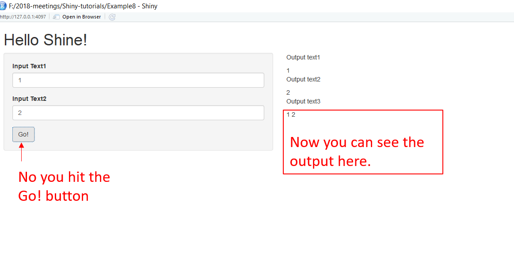

# How to develop a shiny app?

## Resources: Coursera Course - Developing Data Products 

## Users

  - Web app for your prediction algorithm: you want to create a web site so that users can input the relevant predictors and obtain their prediction.
  
## What is Shiny?

  - Shiny is a platform for creating interactive R programs embedded into a web page.  
  
## Three components in web pogamming

  - html: gives a webpage structure and sectioning as well as markup instructions
  
  - css: gives the style of the web page
  
  - java scripts (js): for interactivity
  
## Introduction to Shiny

- Step 1: Install shiny

```r
install.packages("shiny")
library(shiny)
```

- How to create a shiny project?

In order to create a shiny project you need two things:
        
1. ui.R : For use interface, controls how it looks.

      + All of the style elements are handled through ui.R
        
      + If you want to control more then ceate a folder called www and then make necessary changes on index.html file. For students with a lot of expeience in html, js, css it would be breeze and probably easier and more flexible than the R html controls in ui.R
      
      + Functionalities in standard ui.R
      
          + Allow users to upload or download files
              
          + Have tabbed main panels
              
          + Have editable data tables
              
          + Have a dynamic UI
              
          + User defined inputs and outputs
              
          + Put a submit button so that Shiny only execute complex code after user hit submit.
            
2. server.R: Controls what it does/ perform the calculations.
        
3. Distributing a Shiny app
    
    + The quickest way is to send (or put on github or gist or dropbox or whatever) someone the app directory and they can call `runApp`
    
    + or You could create an R package and create a wrapper that calls `runApp`
    
    + Run a shiny server (beyound the scope of this cousera class)
    
        + Requires setting up a (Shiny server)
        
        + Probably easiest if you see one of the virtual machines where they already have Shiny servers running well.
        
        + Don't put system calls in your code (this is one of the first things many of us do for fun, but introduces security concerns.)
        
        
The two files need to be in the same directory (folder). If you tried it and are like most, you had an easy time with `ui.R` but a harder time with `server.R`. Building `ui.R` is pretty trivial. 
  
## More on layouts

1. `sidebar` layout with a main panel is the easiest.

2. Using `shinyUI(fluidpage(` is much more flexible and allows tighter access to the bootstrap style

    + `fluidRow` statements ceate rows and then the `column` function from within it can create columns.
       
    + Tabsets, navlists aand navbars can be created for more complex apps.
    
3. Some layouts

    + `fluidRow()`, `column()`: based on the bootstrap [grid system] (http://v4-alpha.getbootstrap.com/layout/grid/). See ?fluidRow for more details.
    
    + `flowLayout()`: Lays out elements in a left-to-right, top-to-bottom arrangement.
    
    + `sidebarLayout()`: Create a layout with a sidebar and main area. (Most commonly used layout.)
    
    + `splitLayout()`: Lays out elements horizontally, dividing the available horizontal space into equal parts (by default).
    
    + `verticalLayout()`: Create a container that includes one or more rows of content.
    
    
    

  
## Example 1: Output format

  1. Following is a minimal example of ui.R

```r
library(shiny)
shinyUI(pageWithSidebar(

############### body ################

#----- title of my shiny app -----------
  headerPanel("Data science FTWI"),
#----- display of the sidebar panel-----
  sidebarPanel(
  h3('Sidebar text')
  ),
#----- display of the main panel--------
  mainPanel(
  h3('Main Panel text') # h3: 3rd level html heading
  )
#---------------------------------------
##########################################

))

```
  2.  server.R
  
  Following server.R function is not going to do anything.
  
```r
library(shiny)
shinyServer(
## Even though this function is not doing anything we need the following function to be included, this is an unnamed function
  function(input, output){ 
  }
#............................
)

```
  3. runApp
  
  In R, change to the directories with these files and type runApp() as shown below

  
  
  
  
## Another method: source (tsgenerator)

```r
 server <- function(input, output){


}

ui <- flidPage(


)

# Then run

shinyApp(ui = ui, server = server)

```
  
  
  4. Output

  

## Example 2: R function for HTML markups

Note: When creating a shiny app you should be careful of the the commas.

1. ui.R function

```r
library(shiny)
shinyUI(pageWithSidebar(

############### body ################

#----- title of my shiny app -----------
  headerPanel("Illustating markup"),
#----- display of the sidebar panel-----
  sidebarPanel(
  h1('Sidebar text'), # comma after every h label
  h1('H1 text'), 
  h2('H2 text'), 
  h3('H3 text'), 
  h4('H4 text') # no comma here
  ),
#----- display of the main panel--------
  mainPanel(
  h3('Main Panel text') ,
  code('some code'),
  p('some ordinary text')
  )
#---------------------------------------
##########################################

))
```

2. server. R

This is same as example 1

```r
library(shiny)
shinyServer(
 we need the following function to be included
  function(input, output){ 
  }
)
```
 3. Example 2: output

  

## Example 3: Illustrating inputs

1. ui.R

```r
library(shiny)
shinyUI(pageWithSidebar(
############### body ################
#----- title of my shiny app -----------
  headerPanel("Illustating inputs"),
#----- display of the sidebar panel-----
  sidebarPanel(
#........................................
numericInput('id1','Numeric input, labeled id1', 0, min=0, max=10, step=1),
## You will get a dropdown list where min is 0 and max is 10, increment by 1,
## id1: is the input label name
## "Numeric input, labeled id1" is the display label
 
#........................................
checkboxGroupInput("id2", "Checkbox",
                    c("Value 1" = "1",
                      "Value 2" = "2",
                      "Value 3" = "3")),
## Here you'll get a checkbox to include inputs
## id2: label name
## Checkbox: display label
#........................................
dateInput("date", "Date:")
  ),
## Here you'll get a blank box to include the date
## date: label name
## Date: display label
#----- display of the main panel--------
# This main panel display the outputs we entered above
  mainPanel(
  h3('Illustrating outputs'),
  h4('You entered'),
  # "id1" is the label you've given above, "oid1" is the associated output label in the the server.R function
  verbatimTextOutput("oid1"),
    h4('You entered'),
  verbatimTextOutput("oid2"),
  h4('You entered'),
  verbatimTextOutput("odate")

  )
#---------------------------------------
##########################################

))
```
2. server.R

```r
library(shiny)
shinyServer(
#--- Write the function to take corresponding inputs and outputs--------------------------------
  function(input, output){
#------------------------------------------
# If you enter the following codes only then it will show you the things you input
# renderPrint means print the output in printed format
# "id1", "id2" and "date" are the labels specified in ui.R function
    output$oid1 <- renderPrint({input$id1})
    output$oid2 <- renderPrint({input$id2})
    output$odate <- renderPrint({input$date})
  }
#-----------------------------------------
) 

```

3. Example 3: output

  

## Example 4: Let's build our prediction function

User input the values for corresponding predictors and shiny app will give you the predicted values

1. ui.R

```r
library(shiny)
shinyUI(
#--format of the web application interface
  pageWithSidebar(
#--Application title ---------------------
  headerPanel("Diabetes prediction"),
  
#-- Format of the sidebar panel ----------

sidebarPanel(
# The default value for the input is 50
  numericInput('glucose', 'Glucose mg/dl', 90, min=50, max=200, step = 5),
  submitButton('Submmit')
),

#-- Main Panel --------------------------
mainPanel(
  h3('Results of prediction'),
  h4('You entered'),
# the "inputValue" label comes from server.R file
  verbatimTextOutput("inputValue"),
  h4('Which resulted in a prediction of '),
# the "prediction" is also a label which comes from server.R function
  verbatimTextOutput("prediction")
    )
  )
)

```

2. server.R

```r
# This is the prediction function
# prediction function is written outside of the shinyServer
diabetesRisk <- function(glucose) glucose/200

shinyServer(
#---- Write the function to pass inputs and outputs
  function(input, output){
  output$inputValue <- renderPrint({input$glucose})
  output$prediction <- renderPrint({diabetesRisk(input$glucose)})
  }

)


```

3. output: example 4


## Example 5: include plots

1. ui.R

```r
shinyUI(pageWithSidebar(
  headerPanel("Example plot"),
  sidebarPanel(
    sliderInput('mu', 'Guess at the mean', value=70, min=62, max=74, step=0.05)
  ),
  mainPanel(
  # newHist is the name that I've given in the server.R file to create the corresponding histogram
    plotOutput('newHist')
  )
))

```

2. server.R

```r
# First the dataset I need to grab
library(UsingR)
data(galton)

# now write the content of server.R

shinyServer(
# define the function of inputs and outputs ------
function(input, output){
# I give the name to my histogram as "newHist", this name is used in ui.R
    output$newHist <- renderPlot({
    hist(galton$child, xlab="child height", col="lightblue", main="Histogram")
    mu <- input$mu
    lines(c(mu,mu), c(0, 200), col="red", led=5)
    mse <- mean((galton$child-mu)^2)
    text(63, 150, paste("mu = ", mu))
    text(63, 140, paste("MSE = ", round(mse, 2)))
    })

  }
)
```

3. Example 5: output


## Example 6: Shiny updated only the corresponding components only

Eventhough you upload new values it updates only the necessay components associated with the new inputs.

1. ui.R

```r
library(shiny)
shinyUI(pageWithSidebar(
  headerPanel("Hello Shiny!"),
  
  #-- sidebar panel
  sidebarPanel(
    textInput(inputId="text1", label="Input Text1"),
    textInput(inputId="text2", label="Input Text2")
  ),
  mainPanel(
    p('Output text1'),
    textOutput('text1'),
    p('Output text2'),
    textOutput('text2'),
    p('Output text3'),
    textOutput('text3'),
    p('Outside text (x is defined out side the function)'),
    textOutput('text4'),
    p('Inside text, but non-reactive (y is defined inside the function)'),
    textOutput('text5')
  )

))

```
 2. sever.R 
 
 Note: Set `x <- 0` before running
 
```r
 library(shiny)
 x <<- x + 1 # double arrow is to say everything out side the function is globally assigned
 y <<- 0
 
 shinyServer(
  function(input, output){
  y <<- y + 1
  output$text1 <- renderText({input$text1})
  output$text2 <- renderText({input$text2})
  output$text3 <- renderText({as.numeric(input$text1)+1})
  output$text4 <- renderText(y)
  output$text5 <- renderText(x)
  }
 
 )

```
 

3. outputs
 
 The first output
 
 
 
 When you change the inputs for x
 
 

**Note: In the above example watch how it update `text1` and `text2` as needed. It doesn't add 1 to text1 every time a new text2 is input. **

## Example 7: Reactive expressions

  - Sometimes to  speed up your app, you want reactive operations (those operations that depend on widget input values) to be performed outside of a `render*`(for * for plot(renderPlot), text(renderText), etc.) to be performed outside of a render* statement
    
  - For example, you want to do some code that gets reused in several `render*` statements and don not want to recalculate it for each.
    
  - The `reactive` function is made for this purpose.
    
1. ui.R, this is exactly the same as before

```r
library(shiny)
shinyUI(pageWithSidebar(
  headerPanel("Hello Shiny!"),
  
  #-- sidebar panel
  sidebarPanel(
    textInput(inputId="text1", label="Input Text1"),
    textInput(inputId="text2", label="Input Text2")
  ),
  mainPanel(
    p('Output text1'),
    textOutput('text1'),
    p('Output text2'),
    textOutput('text2'),
    p('Output text3'),
    textOutput('text3'),
    p('Outside text (x is defined out side the function)'),
    textOutput('text4'),
    p('Inside text, but non-reactive (y is defined inside the function)'),
    textOutput('text5')
  )

))

```

2. server.R function

```r
shinyServer(
  function(input, output){
  #Calculation of x: I want to do this only once in the function, for that we can use the `reactive` statement
   x <- reactive({as.numeric(input$text1)+100})
   output$text1 <- renderText({x()})
   output$text2 <- renderText({x() + as.numeric(input$text2)})
  }
)
```

## Example 8: Include a `Go` button (Non-reactive reactivity)

    - Sometimes you don't want shiny to immediately perform reactive calculations from widget inputs
    
    - You want something like a go button.
    
1. ui.R

```r
library(shiny)
shinyUI(pageWithSidebar(
  headerPanel("Hello Shine!")
  
  sidebarPanel(
    textInput(inputId="text1", label="Input Text1"),
    textInput(inputId="text2", label="Input Text2"),
    # Input idea is `goButton, the label above the button is Go!`
    actionButton("goButton", "Go!")
  ),
  mainPanel(
    p('Output text1'),
    textOutput('text1'),
    p('Output text2'),
    textOutput('text2'),
    p('Output text3'),
    textOutput('text3')
  )
))

```
2. server.R 

```r
shinyServer(
  function(input, output){
  # As soon as you enter text 1 it will display text 1
    output$text1 <- renderText({input$text1})
  # As soon as you enter text 2 it will display text 2
    output$text2 <- renderText({input$text2})
  # It will print text 1 and text 2 together only when you hit the go button
    output$text3 <- renderText({
      input$goButton # label name that I given for the Go! button
      isolate(paste(input$text1, input$text2)) # isolate the expession until I press the Go! button.
    })
  }
)

```

3. Output 

**When you do not hit the go button!**


**When you hit the go button!**



## Example 9: COnditional statement on Go! button (cont. from Example 8)

1. `input$goButton(or whatever you named it) gets increased by one for every time pushed. 

2.  So, when in reactive code (such as `render` or `reactive`) you can use conditional statemets like below to only execute code on the first button pess or to not execute code until the first or subsequent button press.
    
`if (input$goButton==1) {some statement}`

1. ui.R

same as above.

2. server.R

Same as above, only change in output$text3.

```r
output$text3 <- renderText({
  if(input$goButton == 0) "You have not pressed the button."
  else if (input$goButton == 1) "You pressed it once"
  else "Ok quit pressing it"
})

```

